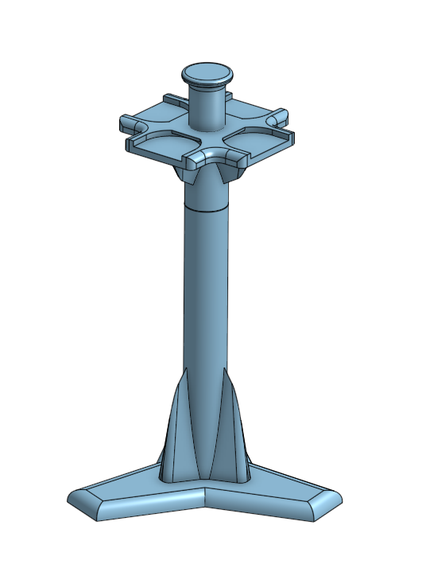

# Open Lab Hardware

Open-source 3D-printable lab equipment and accessories for life science research. Affordable, functional alternatives to commercial lab plastics — designed to be printed on any standard FDM printer.

## Models

### Hydroculture Falcon Collar & Lid

Snap-on collar and lid set for 50 mL Falcon tubes, designed for hydroponic plant cultivation in a lab or at home. The collar holds a polyurethane sponge at the tube opening, supporting the plant while the roots grow into the liquid medium below. The lid sits on top of the collar to block light and prevent algae growth on the sponge.

This is a modified version of the [Falcoponics](https://www.printables.com/model/451575-falcoponics-lab-tube-hydroponics-system) system by [@atinygreencell](https://www.instagram.com/atinygreencell/) on Instagram, adjusted for a better fit with standard 50 mL Falcon tubes.

**Supplies needed:**
- 50 mL Falcon tubes
- [1" polyurethane sponges](https://www.amazon.de/dp/B0B7VR9NTF)
- [Moisture wicks](https://www.amazon.de/dp/B0C7B9RGJK) — use the pre-cut wicks from the set, or cut small strips from the mat

**File:** `Falcon 50 ml collar and lid.stl`

---

### Combined Falcon & Eppendorf Rack

A double-sided tube rack that holds multiple tube sizes in a single compact footprint:

| Side | 50 mL Falcon | 15 mL Falcon | 1.5 mL Eppendorf |
|------|:---:|:---:|:---:|
| **Side A** | 6 | 2 | 6 |
| **Side B** | — | 8 | 6 |

Flip the rack over to access the other side. Keeps everything you need for a typical bench experiment in one place.

Inspired by [this Falcon tube rack on MakerWorld](https://makerworld.com/de/models/251250-falcon-conical-centrifuge-tubes-rack-15-50ml#profileId-267616).

**File:** `laboratory_holders_combined.stl`

---

### Pipette Tip Tower

A vertical standing holder for pipette tip attachment boxes. Stores tip boxes in a stack on a central column with a tripod base for stability, saving bench space while keeping all tip sizes within easy reach.

**File:** `pipette_holder.stl`

Designed for these holders but should work for others as well:

 
---

## Printing guidelines

- **Printer used:** Bambu Lab P1S
- **Material:** PLA works for most lab use. Use PETG for autoclavable parts or chemical resistance
- **Infill:** 20–30% is sufficient for racks and holders
- **Layer height:** 0.2 mm for functional parts, 0.12 mm for tight-fit collars
- **Supports:** noted per model where needed

## Contributing

If you have ideas for lab equipment that should exist but doesn't, or improvements to existing designs, feel free to open an issue.

## License

GPL-3.0
=======

